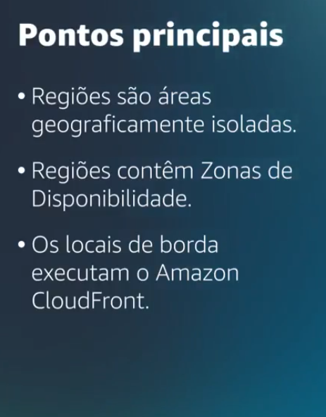

# Curso AWS builder - Elementos esseciais para cloud praticionner

Owner: Monalysa K. Yoshikawa

# **Capitulo 3**

**Infraestrutura global da AWS**

### **Seleção de uma Região**

Escolher um data center para sua empresa é uma decisão importante. Você pode considerar como criterio de escolhas os 4 fatores abaixo: 

- Proximidade com os clientes - Você pod escolher um Região / datacenter proximas de clientes. Se assim o fizer você podera entregar o conteudo com mais rapidez
- Serviços disponiveis - Tem regiões que podem não ter todos os recursos que vocÊ deseja ou precisa. Às vezes, a Região mais próxima pode não ter todos os recursos que você deseja oferecer aos clientes.
- Por preços - Suponha que você pretenda executar aplicações nos Estados Unidos e no Brasil. Com a estrutura tributária do Brasil, pode custar 50% mais caro executar a mesma carga de trabalho na Região São Paulo em comparação com a Região Oregon.
- Conformidade - Dependendo da sua empresa e localização, talvez seja necessário executar seus dados em áreas específicas. Por exemplo, se sua empresa exige que todos os dados residam dentro dos limites do Reino Unido, você deve escolher a Região Londres.

### **Zonas de Disponibilidade**

uma **Zona de Disponibilidade** é um único data center ou um grupo de data centers em uma Região. As Zonas de Disponibilidade estão localizadas a dezenas de quilômetros de distância umas das outras. A proximidade é suficiente para haver baixa latência (tempo entre o momento em que o conteúdo foi solicitado e recebido) entre as Zonas de Disponibilidade. No entanto, se ocorrer um desastre em uma parte da Região, eles estarão distantes o suficiente para reduzir a chance de várias Zonas de Disponibilidade serem afetadas.

Não se deve dispor em uma unica região a aplicação, é indicado colocar em mais de uma Zona de DIsponbilidade assim fica mais seguro caso ocorra algo em uma zona de disponibilidade, assim tera outra para suprir e ajudar.

### Bordas Locais

Um **local de borda** é um site que o Amazon CloudFront usa para armazenar cópias em cache do conteúdo mais próximo dos clientes para uma entrega mais rápida.

O Amazon Claud Front - é um serviço que entrega dados, videos e aplicações. E api em todo o mundo com baixa latencia e altas velocidades de transferencia. o Amazon cloud front usa os locais de borda em todo o mundo para acelerar a comunicação com os usuarios ,ão importando onde eles estejam.

Os serviços de Bordas Locais executam alem do Amazon Cloud Front, executam tambem um serviço de  nome de dominio ou DNS, conhecido como Amazon Route 53, que direciona os clientes em locais corretos da web. 

E se eu quiser usar os serviços da aws em um local reduzido?, Podemos fazer com o AWSOutpost, ele é toytalmente operacional dentro do data center. Essa região pertence a aws, é operada pro ela e tem 100% da funcionalidade da AWS, mas ela ficara isolada dentro do predio da empresa.

[https://www.notion.so](https://www.notion.so)

A resposta correta é **Um serviço global de entrega de conteúdo**.

O Amazon CloudFront é um serviço de entrega de conteúdo. Ele usa uma rede de locais de borda para armazenar conteúdo em cache e entregar conteúdo para clientes em todo o mundo. Quando o conteúdo é armazenado em cache, ele é mantido localmente como uma cópia. Esse conteúdo pode ser arquivos de vídeo, fotos, páginas da web e assim por diante.

As outras respostas estão incorretas porque:

- O AWS Outposts é um serviço que permite executar a infraestrutura em uma abordagem de nuvem híbrida.
- O AWS Fargate é um mecanismo de computação sem servidor para contêineres.
- O Amazon Simple Queue Service (Amazon SQS) é um serviço que permite enviar, armazenar e receber mensagens entre componentes de software por uma fila.

[https://aws.amazon.com/pt/cloudfront/](https://aws.amazon.com/pt/cloudfront/)

[https://aws.amazon.com/pt/cloudfront/features/?nc=sn&loc=2&whats-new-cloudfront.sort-by=item.additionalFields.postDateTime&whats-new-cloudfront.sort-order=desc#Amazon_CloudFront_Infrastructure](https://aws.amazon.com/pt/cloudfront/features/?nc=sn&loc=2&whats-new-cloudfront.sort-by=item.additionalFields.postDateTime&whats-new-cloudfront.sort-order=desc#Amazon_CloudFront_Infrastructure)

### **Como provisionar recursos AWS**

# **Maneiras de interagir com os serviços da AWS**

Para saber maneiras de interagir com os serviços da AWS, selecione cada uma das três guias a seguir.

O **console de gerenciamento da AWS** é uma interface baseada na web para acessar e gerenciar os serviços da AWS. Você pode acessar rapidamente os serviços usados recentemente e pesquisar outros serviços por nome, palavra-chave ou acrônimo. O console inclui assistentes e fluxos de trabalho automatizados que podem simplificar o processo de conclusão de tarefas.

Você também pode usar o AWS Console Mobile Application para executar tarefas como monitoramento de recursos, visualização de alarmes e acesso a informações de cobrança. Várias identidades podem permanecer em sessão no AWS Console Mobile Application ao mesmo tempo.

Links sobre o modulo 3 :

- [Infraestrutura global(opens in a new tab)](https://aws.amazon.com/about-aws/global-infrastructure/)
- [Mapa interativo da infraestrutura global da AWS(opens in a new tab)](https://www.infrastructure.aws/)
- [Regiões e Zonas de Disponibilidade(opens in a new tab)](https://aws.amazon.com/about-aws/global-infrastructure/regions_az)
- [Blog de redes e entrega de conteúdo da AWS(opens in a new tab)](https://aws.amazon.com/blogs/networking-and-content-delivery/)
- [Ferramentas de criação na AWS(opens in a new tab)](https://aws.amazon.com/tools/)
- [Histórias de clientes da AWS: entrega de conteúdo](https://aws.amazon.com/solutions/case-studies/?customer-references-cards.sort-by=item.additionalFields.publishedDate&customer-references-cards.sort-order=desc&awsf.customer-references-location=*all&awsf.customer-references-segment=*all&awsf.customer-references-product=product%23vpc%7Cproduct%23api-gateway%7Cproduct%23cloudfront%7Cproduct%23route53%7Cproduct%23directconnect%7Cproduct%23elb&awsf.customer-references-category=category%23content-delivery)
- [https://aws.amazon.com/pt/outposts/](https://aws.amazon.com/pt/outposts/)

# MODULO 4 - REDES

O Amazon VPC permite que você provisione uma seção isolada da nuvem AWS. Nessa seção isolada, você pode executar os recursos em uma rede virtual que definir. Em uma Virtual Private Cloud (VPC), você pode organizar seus recursos em sub-redes. Uma **sub-rede** é uma seção de uma VPC que pode conter recursos como instâncias do Amazon EC2.

Links uteis 
[https://docs.aws.amazon.com/vpc/latest/userguide/how-it-works.html](https://docs.aws.amazon.com/vpc/latest/userguide/how-it-works.html)

[https://aws.amazon.com/pt/vpc/](https://aws.amazon.com/pt/vpc/)

# **Gateway de internet**

Para permitir que o tráfego público da internet acesse sua VPC, é preciso anexar um **gateway de internet** à VPC.

VPC É a sua rede privada da AWS 

Ícone do gateway de internet anexado a uma VPC que contém três instâncias do EC2. Uma seta conecta o cliente ao gateway na internet indicando que a solicitação do cliente obteve acesso à VPC.

Um gateway da internet é uma conexão entre uma VPC e a internet. Você pode pensar em um gateway da internet como sendo semelhante a uma porta que os clientes usam para entrar na cafeteria. Sem um gateway da internet, ninguém pode acessar os recursos em sua VPC.

# **Gateway privado virtual**

Para acessar recursos privados em uma VPC, use um **gateway privado virtual**.

O gateway privado virtual é o componente que permite que o tráfego protegido da internet ingresse na VPC. Mesmo que sua conexão com a cafeteria tenha proteção extra, os engarrafamentos são possíveis porque você usa o mesmo caminho que outros clientes.

Um gateway privado virtual permite estabelecer uma conexão VPN (rede privada virtual) entre a VPC e uma rede privada, como um data center on-premises ou uma rede corporativa interna. Um gateway privado virtual permitirá o tráfego na VPC somente se ele for proveniente de uma rede aprovada.

# **AWS Direct Connect**

O [**AWS Direct Connect**(opens in a new tab)](https://aws.amazon.com/directconnect/) é um serviço que permite estabelecer uma conexão privada dedicada entre seu data center e uma VPC.

É como ter um caminho direta e unica entre seus data center e seu vpc 

Um data center corporativo roteia tráfego de rede para uma localização do AWS Direct Connect. Em seguida, esse tráfego é roteado para uma VPC por meio de um gateway privado virtual. Todo o tráfego de rede entre o data center corporativo e a VPC passa por essa conexão privada dedicada.

A conexão privada do AWS Direct Connect ajuda a reduzir os custos de rede e a aumentar a quantidade de largura de banda que pode trafegar pela rede.

### **Sub-redes e listas de controle de acesso à rede**

**stateful** Os grupos de segurança fazem a filtragem de pacotes **stateful**. Eles se lembram de decisões anteriores tomadas para pacotes recebidos.

# **Sub-redes**

Uma sub-rede é uma seção de uma VPC na qual você pode agrupar recursos com base em necessidades operacionais ou de segurança. As sub-redes podem ser públicas ou privadas.

**Sub-redes públicas** contêm recursos que precisam ser acessíveis ao público, como o site de uma loja on-line.

As **sub-redes privadas** contêm recursos que devem ser acessíveis apenas pela sua rede privada, como um banco de dados que contém informações pessoais dos clientes e históricos de pedidos. 

Lista de controle de acesso à rede (ACL de rede)

Uma ACL de rede só consegue avaliar um pacote quando ela entra e sai de uma subrede

# **Tráfego de rede em uma VPC**

Quando um cliente solicita dados de um aplicativo hospedado na nuvem AWS, essa solicitação é enviada como um pacote. Um **pacote** é uma unidade de dados enviada pela internet ou por uma rede.

Ele entra em uma VPC por um gateway de internet. Antes de um pacote poder entrar em uma sub-rede ou sair de uma sub-rede, ele verifica se há permissões. Essas permissões indicam quem enviou o pacote e como ele tenta se comunicar com os recursos em uma sub-rede.

O componente da VPC que verifica as permissões de pacotes das sub-redes é uma [**lista de controle de acesso (ACL) de rede**(opens in a new tab)](https://docs.aws.amazon.com/vpc/latest/userguide/vpc-network-acls.html).
Então uma ACL é uma lista de controle de acesso

**ACLs de rede**

O oficial de controle de passaportes verifica as credenciais dos viajantes quando entram e saem do país. Se um viajante estiver em uma lista aprovada, ele poderá passar. No entanto, se ele não estiver na lista aprovada ou estiver explicitamente em uma lista de viajantes proibidos, ele não poderá entrar.

Stetass

As ACLs de rede executam a filtragem de pacotes **stateless**. Elas não se lembram de nada e verificam os pacotes que atravessam a fronteira da sub-rede em todos os sentidos: entrada e saída. 

A resposta correta é **Ela é stateless e permite todo o tráfego de entrada e saída**.

As ACLs de rede (listas de controle de acesso de rede) fazem a filtragem de pacotes **stateless**. Elas não se lembram de nada e verificam os pacotes que atravessam a fronteira da sub-rede nos dois sentidos: entrada e saída.

Cada conta AWS tem uma ACL de rede-padrão. Ao configurar a VPC, você pode usar a ACL de rede-padrão da conta ou criar ACLs de rede personalizadas.

Por padrão, a ACL de rede-padrão da conta permite todo o tráfego de entrada e saída, mas você pode modificá-la adicionando suas regras. Para ACLs de rede personalizadas, todo o tráfego de entrada e saída é negado até que você adicione regras para especificar qual tráfego deve ser permitido. Além disso, todas as ACLs de rede têm uma regra de negação explícita. Essa regra garante que, se um pacote não corresponder a nenhuma das outras regras na lista, ele será negado.

**Saiba mais:** [https://docs.aws.amazon.com/vpc/latest/userguide/vpc-network-acls.html](https://docs.aws.amazon.com/vpc/latest/userguide/vpc-network-acls.html)

**Grupos de segurança**

Um grupo de segurança é um firewall virtual que controla o tráfego de entrada e saída de uma instância do Amazon EC2.

**Grupos de segurança são stateful e negam todo o tráfego de entrada por padrão**.

Grupos de segurança são stateful. Isso significa que eles usam padrões e fluxos de tráfego anteriores ao avaliar novas solicitações para uma instância.

Por padrão, os grupos de segurança negam todo o tráfego de entrada, mas você pode adicionar regras personalizadas para atender às suas necessidades operacionais e de segurança.

[https://docs.aws.amazon.com/vpc/latest/userguide/vpc-security-groups.html](https://docs.aws.amazon.com/vpc/latest/userguide/vpc-security-groups.html)

**Amazon Route 53**.

O Amazon Route 53 é um serviço da web de DNS. Ele oferece aos desenvolvedores e empresas uma maneira confiável de direcionar os usuários finais para aplicações da internet hospedados na AWS.

Outro recurso do Route 53 é a capacidade de gerenciar os registros DNS para nomes de domínio. Você pode transferir registros DNS para nomes de domínio existentes gerenciados por outras empresas de registro de domínio. Você também pode registrar novos nomes de domínio diretamente no Route 53.

As outras respostas estão incorretas porque:

- O Amazon Virtual Private Cloud (Amazon VPC) é um serviço que permite provisionar uma seção isolada da nuvem AWS. Nesta seção isolada, é possível iniciar recursos em uma rede virtual definida por você.
- O AWS Direct Connect é um serviço que permite estabelecer uma conexão privada dedicada entre o seu data center e a VPC.
- O Amazon CloudFront é um serviço de entrega de conteúdo. Ele usa uma rede de locais de borda para armazenar conteúdo em cache e entregar conteúdo para clientes em todo o mundo.

**Saiba mais:**

- [Amazon Route 53](https://aws.amazon.com/route53)

# MODULO 5 - Armazenamento e Banco de Dados

Um [**armazenamento de instância**(opens in a new tab)](https://docs.aws.amazon.com/AWSEC2/latest/UserGuide/InstanceStorage.html) é um meio temporário de armazenamento a nível de bloco para uma instância do Amazon EC2. Um armazenamento de instância é o armazenamento em disco fisicamente anexo ao computador host para uma instância do EC2 e, portanto, tem a mesma vida útil da instância. Quando a instância for terminada, você perderá todos os dados no armazenamento de instância.
O [**Amazon Elastic Block Store (Amazon EBS)**(opens in a new tab)](https://aws.amazon.com/ebs) é um serviço que fornece volumes de armazenamento a nível de bloco que você pode usar com instâncias do Amazon EC2. Se você interromper ou terminar uma instância do Amazon EC2, todos os dados no volume do EBS anexo permanecerão disponíveis.
Como os volumes do EBS são para dados que precisam perdurar, é importante fazer backup dos dados. Você pode fazer backups incrementais de volumes do EBS criando snapshots do Amazon EBS.

Um [**snapshot do EBS**(opens in a new tab)](https://docs.aws.amazon.com/AWSEC2/latest/UserGuide/EBSSnapshots.html) é um backup incremental. Isso significa que o primeiro backup de um volume copia todos os dados. Nos backups subsequentes, somente os blocos de dados que foram alterados desde o snapshot mais recente são salvos. 

”**Meu entendimento um EBS quer dizer que sera feito um backup de todos os itens, nos backups posteriores ele fara somente de dados que foram alterados e recentes. Exemplo suponto que eu tenho or arquivos 1, 2, 3, ja feitos o backup deles. Agora suponha que o item 2 teve uma alteração e que foio adicionado mais um item chamado 4, no proximo backup sera salvo o item 2 e o 4 icrementando o backup anterior. Entretanto o backup completo inclui dados que não foram alterados desde o backup mais recente.”**

### **Amazon Simple Storage Service (Amazon S3)**

https://aws.amazon.com/s3/

é um serviço que fornece armazenamento a nível do objeto. O Amazon S3 armazena dados como objetos em buckets. É possível fazer upload de qualquer tipo de arquivo para o Amazon S3, como imagens, vídeos, arquivos de texto e assim por diante.

Ao selecionar uma storage class do Amazon S3, considere estes dois fatores:

- Com que frequência você planeja recuperar seus dados
- Seus dados precisam estar muito ou pouco disponíveis

Amazon S3 armazena e recupera uma quantidade ilimitada de dados

### **Amazon Elastic File System (Amazon EFS)**

o armazenamento de arquivos é ideal para casos de uso em que um grande número de serviços e recursos precisam acessar os mesmos dados ao mesmo tempo.

é um sistema de arquivos dimensionável usado com os AWS Cloud Services e recursos on-premises. À medida que você adiciona e remove arquivos, o Amazon EFS expande e retrai automaticamente. Ele pode dimensionar sob demanda para petabytes sem interromper os aplicativos. 

https://aws.amazon.com/pt/efs/

Comparação do Amazon EBS e Amazon Elastic File System

EBS:
- Tanto a instancia quanto o volume do EBS precisam estar na mesma Zona de Disponibilidade
- Armazena dados em uma unica Zona de Disponibilidade.
-0 Volumes associado a instancias do EC2

Amazon Elastic File System EFS:
- os servidores on-premises podem acessar o Amazon Elastic File System usando o AWS Direct Connect
- um serviço regional
-Ele armazena dados em **várias** Zonas de Disponibilidade e entre elas. 
- Varias instancias podem acessar os dados no EFS ao mesmo tempo.
- Dimensiona automaticamente
- Varias instancias lendo e gravando automaticamente

### **Amazon Relational Database Service (Amazon RDS)**

[**O Amazon Relational Database Service (Amazon RDS)**(opens in a new tab)](https://aws.amazon.com/rds/) é um serviço que permite executar bancos de dados relacionais na nuvem AWS.