# CSS

Owner: Monalysa K. Yoshikawa

<aside>
💡 Anotações de css

</aside>

# links:

Basic

[https://www.youtube.com/watch?v=yfoY53QXEnI](https://www.youtube.com/watch?v=yfoY53QXEnI)

**OU**

[https://www.youtube.com/watch?v=FqmB-Zj2-PA](https://www.youtube.com/watch?v=FqmB-Zj2-PA)

**Intermediario:**

[https://www.theodinproject.com/paths/full-stack-javascript/courses/intermediate-html-and-css](https://www.theodinproject.com/paths/full-stack-javascript/courses/intermediate-html-and-css)

**Exercício FlexBox/Grid game**

[https://flexboxfroggy.com/](https://flexboxfroggy.com/)

[https://cssgridgarden.com/](https://cssgridgarden.com/)

[https://www.codecademy.com/learn/learn-intermediate-css](https://www.codecademy.com/learn/learn-intermediate-css)

[https://www.codecademy.com/learn/learn-css-flexbox-and-grid](https://www.codecademy.com/learn/learn-css-flexbox-and-grid)

Praticar

****Como Animar Fundo da Página no CSS :**** [https://www.youtube.com/watch?v=qeR67fOFAEI](https://www.youtube.com/watch?v=qeR67fOFAEI)
****Criando animações e transições em CSS:**** [https://www.youtube.com/watch?v=JJiyguTeBzU](https://www.youtube.com/watch?v=JJiyguTeBzU)

# Css

Seletores CSS

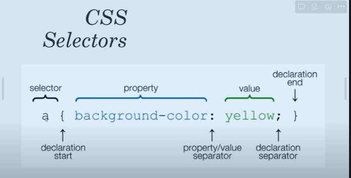

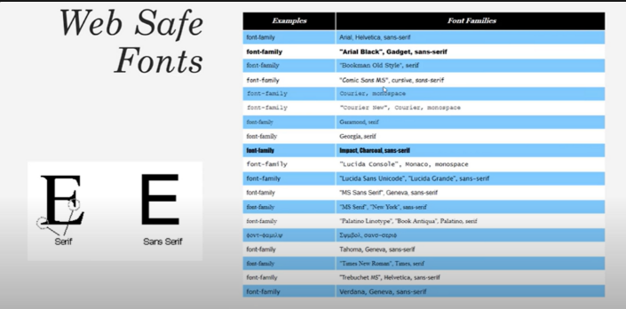

# Anotações

`text-decoration:underline` deixa ele sublinhado

`text-transform:uppercase` Deixa tudo maiúsculo

`letter-spacing:0.2em` deixa um espacinho entre as letras

`flex-flow` foi criado para combinar ações do `flex-direction` e `flex-wrap`. Sendo assim para usar o `flex-flow` o primeiro elemento é o relacionato ao `flex-direction` e o segundo ao `flex-wrap`, ex: `column wrap`.

`align-content` para definir como várias linhas são espaçadas umas das outras. determina o espaçamento entre as linhas

`align-items` determina como os itens como um todo são alinhados dentro do contêiner.

o hover deixa um efeito de mudr de cor quando passa o mouse por cima

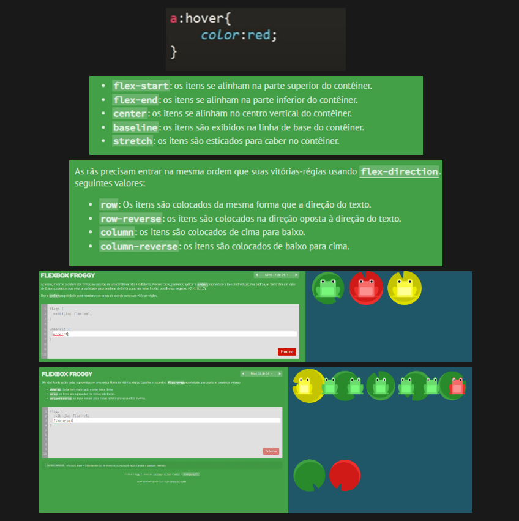


# Psdoclasse

Tipo vc chama uma classe e add uma classe de ação para ele. 

Exemplo 

`.seletor:haver {`

   `Background: Red` 

`}`

Pseudo-elem

O [Coolors](https://coolors.co/) possui uma interface bem clara. Com a barra de espaço do seu teclado, você consegue criar várias combinações, e uma das funções mais legais é a opção travar, que você pode usar se gostar de apenas uma cor, e assim que você clica nela, consegue continuar elaborando outras combinações levando em conta a cor que você escolheu.

O [Color Hunt](https://colorhunt.co/) dispõe de diversas paletas elaboradas. Você consegue encontrar a combinação que mais te agrada e consegue buscar por palavras-chave como pastel, vintage, neon e assim por diante. E caso não encontre nenhuma que te agrade, você consegue criar a sua própria paleta clicando nos três pontinhos do canto superior direito da página.

# Nome de classes

[https://www.alura.com.br/artigos/nomes-de-classes-no-css](https://www.alura.com.br/artigos/nomes-de-classes-no-css)

**(B)lock** - Esse seria basicamente o que o **SMACSS** chama de Módulo e o que chamamos aqui de componente também, isso seria qualquer componente que criamos que possa ser reutilizado em várias páginas, como o caso do nosso box ou da navbar.

De agora em diante quando eu me referir a block ou bloco vou estar falando de algum componente.

**(E)lement** - Esse seria um elemento que está dentro do nosso bloco

**(M)odifier** - Esse seria o nosso modificador, lembra do active? navbar-itemActive.

O que o BEM propõe é organizar esses nomes, que nomes vamos dar para os elementos? E os modifiers? E os blocks? Ele ajuda a gente a seguir um padrão. Para o BEM esse padrão seria:

`block__element--modifier`

# ****Reset CSS: O que é?****

Cada navegador tem a sua apresentação por padrão e esse comportamento individualizado pode gerar conflitos de layout diante do seu projeto web.

A técnica do reset css é uma forma de suavizar estas diferenças e padronizar a estilização, sobrepondo a formatação original do browsers com uma folha de estilo. Assim, o reset css se tornou um arquivo quase que obrigatório em cada projeto web que tem por aí.

Pelo o que entendi seria uma configuração padrão para o css, um arquivo com configurações basicas do css.

`<link rel="stylesheet" href="reset.css">` essa é a forma de declarar o seus reset css

Duvidas: 
Por que usar essa configuração padrão é pq em um browser é uma coisa e em outro browser ele pode ir de outro formato?

Normalize e reset parece ter a mesma finalidade em um projeto eu escolho um dos dois ou os dois?
Por quer usar essa configuração padrão? Se eu ja colocar uma estilização no css preciso ter o reset.css pq a minha estilização ira falhar dependendo do browser?

# Especificidade css

CSS é uma folha de estilo em cascata ou seja numa sequencia.

Especificidade é do maior para o menor 
links: [https://developer.mozilla.org/pt-BR/docs/Web/CSS/Specificity](https://developer.mozilla.org/pt-BR/docs/Web/CSS/Specificity)
[https://specificity.keegan.st/](https://specificity.keegan.st/)
**Se usar o `!important`** ela passa por cima das sequencia e define como importante não é muito recomendado.  Pq essa abordagem com uso continuo vira um ciclo vicioso

**Seletores mais especificos:** Se por exemplo você coloca um estilo em uma tag <p>tipo  background branco para a tag `<p>` e depois chama uma classe `.nome` e coloca um background de azul, pela regra da especificidade o que esta mais especifico sera priorizado 
**Ultima regra processada  (empate):** O ultimo processado tem prioridade 

Calculadora de specificity

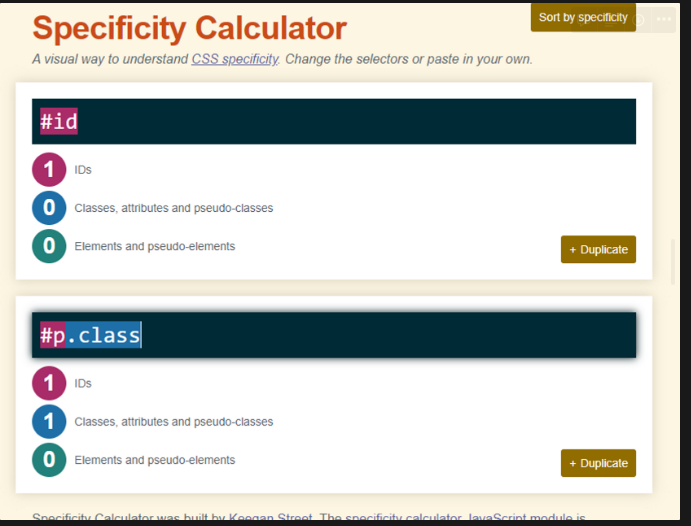

# Herança

link: [https://developer.mozilla.org/pt-BR/docs/Web/CSS/Inheritance](https://developer.mozilla.org/pt-BR/docs/Web/CSS/Inheritance)

`inherit` palavra usada para herdar configuração de outra css 

```jsx
body {
      font-family: ‘Oswald’, sans-serif;
      border: solid 3px red;
      padding: 50px;
}
div{
   border: inherit;
   padding: inherit;
}
```

# Box Model

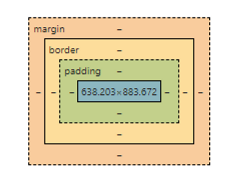

No box model sempre tem 
Margin
border
Padding
content

# Propriedade Display

`display: block;` block significa que cada elemento será sua própria linha. Ele causa que o efeito será impresso na sua própria linha uma linha individual.
`display: inline;` A largura e altura é desconsiderada em um display inline e mantem tudo na mesma linha.

`display: inline-bock;` aqui ele deixa na linha mas considera os tamanhos de largura e altura.

# Box Sizing

Se você quise que a parte da borda para dentro seja considerado como tamanho solicitado pode usar a propriedade `box-sizing` 

A propriedade CSS `box-sizing`nos permite incluir o preenchimento e a borda na largura e altura total de um elemento.

[https://www.w3schools.com/css/css3_box-sizing.asp](https://www.w3schools.com/css/css3_box-sizing.asp)

# Propriedade Overflow

As vezes tem situações que você uma imagem ou conteudo vai ocupar outro elemento. Uma forma de amenizar isso seria aplicando `overflow`

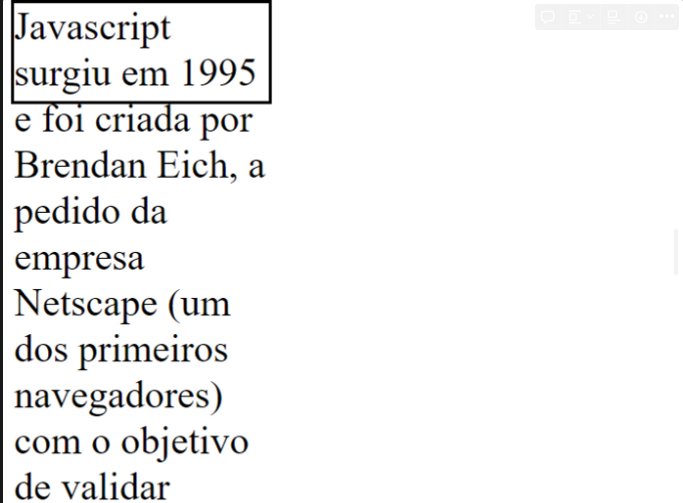

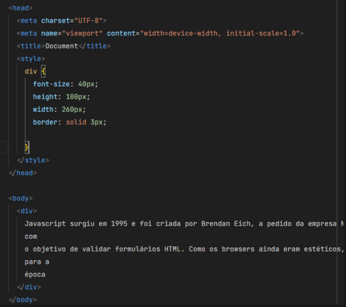

Aplicando o `overflow: hidden;` 

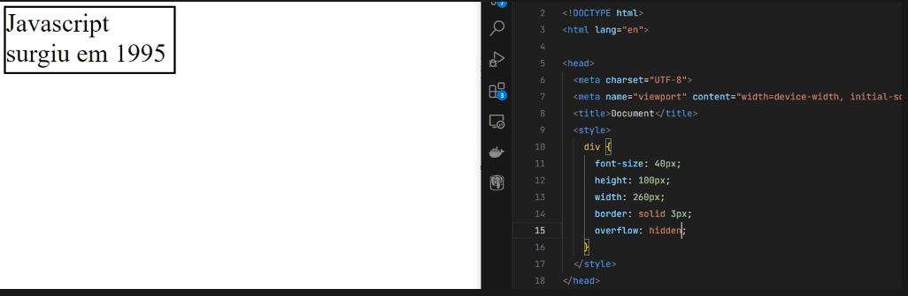

Aplicando `overflow: scroll;`

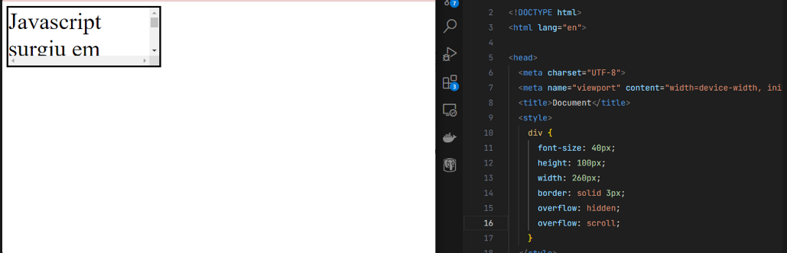

Se eu colocar `overflow-x: scroll;` será um scroll apenas no eixo X

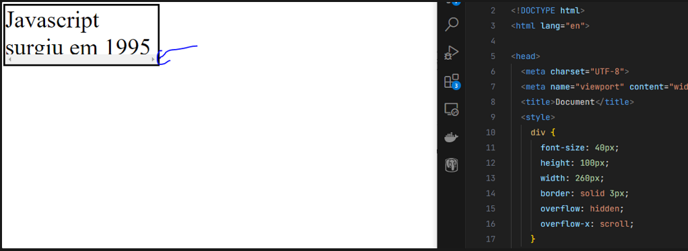

Se eu colocar `overflow-y: scroll;` sera um scroll apenas no eixo Y

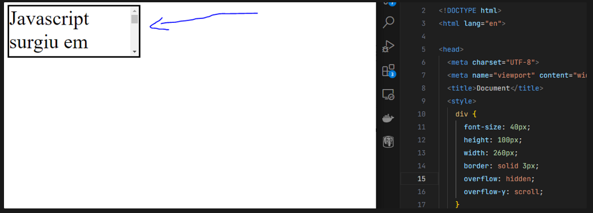

# Propriedade Float

é para configuração da flutuação do elemento 

A propriedade **float** do CSS determina que um elemento deve ser retirado do seu fluxo normal e colocado ao longo do lado direito ou esquerdo do seu containêr, onde textos e elementos em linha irão se posicionar ao seu redor.
[https://www.w3schools.com/css/css_float.asp](https://www.w3schools.com/css/css_float.asp)

[https://developer.mozilla.org/pt-BR/docs/Web/CSS/float](https://developer.mozilla.org/pt-BR/docs/Web/CSS/float)

Aplicando o `float: left`

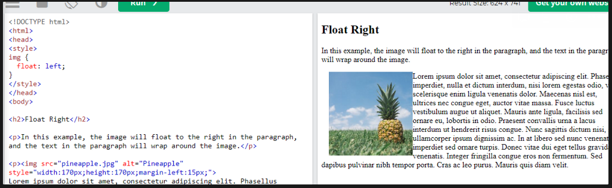

Aplicando `float:right`

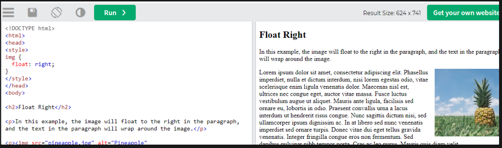

Praticando o float 
[https://www.w3schools.com/css/tryit.asp?filename=trycss_layout_float3](https://www.w3schools.com/css/tryit.asp?filename=trycss_layout_float3)

# Cores

## Valor HSL

Em CSS, uma cor pode ser especificada usando matiz, saturação e luminosidade (HSL) na forma:

**hsl( *matiz* , *saturação* , *luminosidade* )**

Matiz é um grau na roda de cores de 0 a 360. 0 é vermelho, 120 é verde e 240 é azul.

A saturação é um valor percentual. 0% significa um tom de cinza e 100% é a cor total.

A leveza também é uma porcentagem. 0% é preto, 50% não é nem claro nem escuro, 100% é branco

[https://www.w3schools.com/css/css_colors_hsl.asp](https://www.w3schools.com/css/css_colors_hsl.asp) é uma calculadora de cores do HSL 

[https://paletton.com/#uid=1000u0kllllaFw0g0qFqFg0w0aF](https://paletton.com/#uid=1000u0kllllaFw0g0qFqFg0w0aF)

## Valor HEX

Em CSS, uma cor pode ser especificada usando um valor hexadecimal na forma:

**#rrggbb *_***

Onde rr (vermelho), gg (verde) e bb (azul) são valores hexadecimais entre 00 e ff (o mesmo que decimal 0-255).

Por exemplo, #ff0000 é exibido em vermelho, porque o vermelho está definido para seu valor mais alto (ff) e os outros estão definidos para o valor mais baixo (00).

Para exibir preto, defina todos os valores como 00, assim: #000000.

Para exibir branco, defina todos os valores para ff, assim: #ffffff.

## Valor RGB

Em CSS, uma cor pode ser especificada como um valor RGB, usando esta fórmula:

**rgb ( *vermelho, verde* , *azul* )**

Cada parâmetro (vermelho, verde e azul) define a intensidade da cor entre 0 e 255.

Por exemplo, rgb(255, 0, 0) é exibido como vermelho, porque vermelho é definido como seu valor mais alto (255) e os outros são definidos como 0.

Para exibir preto, defina todos os parâmetros de cor como 0, assim: rgb(0, 0, 0).

Para exibir branco, defina todos os parâmetros de cor para 255, assim: rgb(255, 255, 255).

# Unidades

Absolutos: 
- `px`
- `cm`
- `mm`
Viewport:
- `vh`
- `vw`
- `vmin` é a menor dimenção
- `vmax` é a maior dimenção
Font:
- `em` font baseada na tag pai
- `rem` tamanho relativo em referencia a raiz
% 

Viewport e Fonts são unidades relativas

## Comprimentos absolutos

As unidades de comprimento absoluto são fixas e um comprimento expresso em qualquer um deles aparecerá exatamente com esse tamanho.

Unidades de comprimento absoluto não são recomendadas para uso na tela, porque os tamanhos de tela variam muito. No entanto, eles podem ser usados se a mídia de saída for conhecida, como para layout de impressão.

| Unit | Description |
| --- | --- |
| cm | centimetershttps://www.w3schools.com/css/tryit.asp?filename=trycss_unit_cm |
| mm | millimetershttps://www.w3schools.com/css/tryit.asp?filename=trycss_unit_mm |
| in | inches (1in = 96px = 2.54cm)https://www.w3schools.com/css/tryit.asp?filename=trycss_unit_in |
| px * | pixels (1px = 1/96th of 1in)https://www.w3schools.com/css/tryit.asp?filename=trycss_unit_px |
| pt | points (1pt = 1/72 of 1in)https://www.w3schools.com/css/tryit.asp?filename=trycss_unit_pt |
| pc | picas (1pc = 12 pt) |
|  |  |

## Comprimentos Relativos

As unidades de comprimento relativo especificam um comprimento relativo a outra propriedade de comprimento. As unidades de comprimento relativo escalam melhor entre diferentes mídias de renderização.

| Unit | Description |
| --- | --- |
| em | Relative to the font-size of the element (2em means 2 times the size of the current font) |
| ex | Relative to the x-height of the current font (rarely used) |
| ch | Relative to width of the "0" (zero) |
| rem | Relative to font-size of the root element |
| vw | Relative to 1% of the width of the viewport* |
| vh | Relative to 1% of the height of the viewport* |
| vmin | Relative to 1% of viewport's* smaller dimension |
| vmax | Relative to 1% of viewport's* larger dimension |
| % | Relative to the parent element |

# Propriedade Position

Temos algumas configurações para posições de elementos. 
[https://www.w3schools.com/css/css_positioning.asp](https://www.w3schools.com/css/css_positioning.asp)

A `position`propriedade especifica o tipo de método de posicionamento usado para um elemento. Existem cinco valores de posição diferentes:

- `static`
- `relative`
- `fixed`
- `absolute`
- `sticky`

Os elementos são então posicionados usando as propriedades superior, inferior, esquerda e direita. No entanto, essas propriedades não funcionarão, a menos que a `position` propriedade seja definida primeiro. Eles também funcionam de forma diferente, dependendo do valor da posição.
Exemplo de position

```html
<html lang="en">

<head>
  <meta charset="UTF-8">
  <meta name="viewport" content="width=device-width, initial-scale=1.0">
  <title>Document</title>
  <style>
    div {
      font-size: 60px;
      padding: 30px;
      height: 100px;
      width: 260px;
      border: solid 5px #222;
    }

    .static {
      top: 100px;
      left: 100px;
      background-color: steelblue;
    }

    .fixed {
      position: fixed;
      bottom: 30px;
      right: 0px;
      background-color: tomato;
    }

    .relative1 {
      position: relative;
      left: 50px;
      top: 5px;
      background-color: blueviolet;
    }

    .absolute1 {
      position: absolute;
      left: 0px;
      top: 0px;
      background-color: seagreen;
    }

    .relative2 {
      position: relative;
      left: 250px;
      top: 2000px;
      width: 200px;
      height: 200px;
      background-color: slategrey;
    }

    .absolute2 {
      position: absolute; // ele fica de forma absoluta dentro da tag pai
      left: 10px;
      top: 10px;
      width: 20px;
      height: 20px;
      background-color: rgb(205, 240, 11);
    }

		.sticky {
      position: -webkit-sticky;
      position: sticky;
      background-color: coral;
      top: 10px;
    }
  </style>
</head>

<body>
  <div class="static">Static</div>
  <div class="fixed">Fixe</div>
  <div class="relative1">Relative</div>
  <div class="absolute1">Absolute</div>

  <div class="relative2">
    <div class="absolute2"></div>
  </div>

  <div class="sticky"> sticky</div>
  <p style="padding-bottom: 2000px;">OPA</p>
</body>

</html>
```

Dependendo da posição da tag pai com relação a tag filho os comportamentos podem se alterar por exemplo
do exemplo acima antes de alterar, a `class absolute2` ele encontra-se assim:

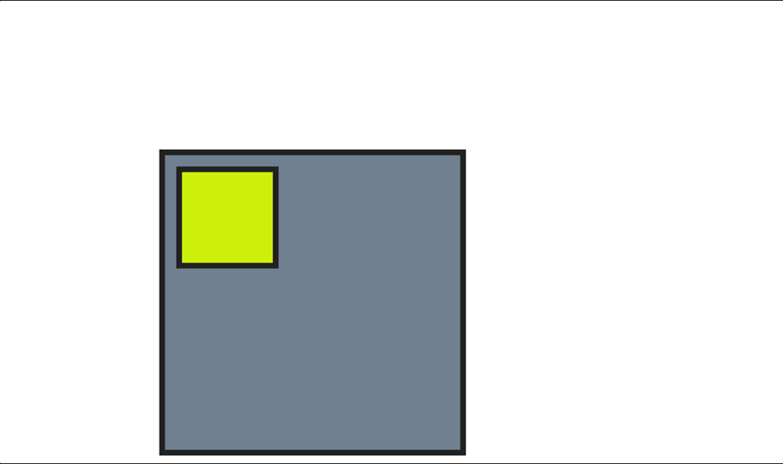

Se tiramos o position do .relative2 vera que o elemento da tag filho absolute2 sofrera mudanças

```html
.relative2 {
      ~~position: relative;~~
      left: 250px;
      top: 2000px;
      width: 200px;
      height: 200px;
      background-color: slategrey;
    }

    .absolute2 {
      position: absolute;
      left: 10px;
      top: 10px;
      width: 20px;
      height: 20px;
      background-color: rgb(205, 240, 11);
    }
```

Passando a ficar assim:

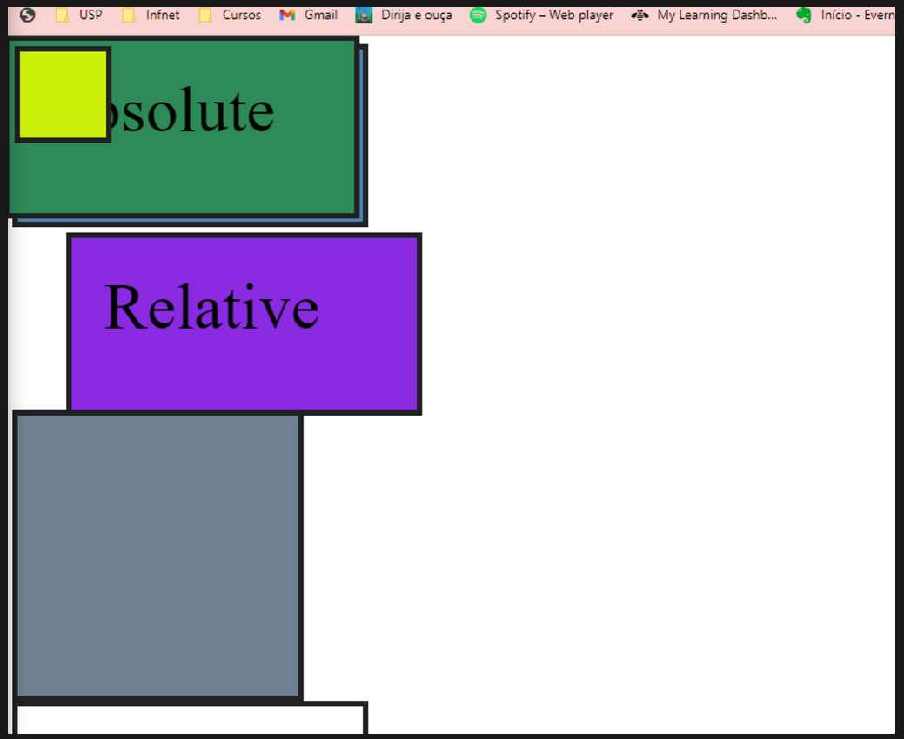

# Media Query

A media query te ajuda na responsividade.Atualmente o mais conhecido é o bootstrap
Uma **media query** consiste de um *media type* e pelo menos uma expressão que limita o escopo das folhas de estilo usando *media features*, tal como largura, altura e cor. *Media queries*, adicionadas no CSS3, deixam a apresentação do conteúdo adaptado a uma gama especifica de dispositivos não precisando mudar o conteúdo em si.

`<link rel="stylesheet" media="(max-width: 800px)" href="example.css" />`

```css
<!-- CSS media query dentro de um stylesheet -->
@media (max-width: 600px){
  .facet_sidebar
   {
    display: none;
   }
}
```

Podemos mexer na largura maxima, largura minima, orientação.

 [https://developer.mozilla.org/pt-BR/docs/Web/CSS/CSS_media_queries/Using_media_queries](https://developer.mozilla.org/pt-BR/docs/Web/CSS/CSS_media_queries/Using_media_queries)

# Flex Box

O módulo de layout de caixa flexível torna mais fácil projetar uma estrutura de layout responsiva flexível sem usar flutuação ou posicionamento.

Para começar a usar o modelo Flexbox, você precisa primeiro definir um flex container.

```jsx
<div class="flex-container">
  <div>1</div>
  <div>2</div>
  <div>3</div>
</div>
```

- `[flex-direction](https://www.w3schools.com/css/css3_flexbox_container.asp#flex-direction)`
- `[flex-wrap](https://www.w3schools.com/css/css3_flexbox_container.asp#flex-wrap)`
- `[flex-flow](https://www.w3schools.com/css/css3_flexbox_container.asp#flex-flow)`
- `[justify-content](https://www.w3schools.com/css/css3_flexbox_container.asp#justify-content)`
- `[align-items](https://www.w3schools.com/css/css3_flexbox_container.asp#align-items)` 
`Align-items: stretch` você estará esticando os elementos
- `[align-content](https://www.w3schools.com/css/css3_flexbox_container.asp#align-content)`

`flex-direction` = Você define a direção do container com ele você pode usar `column` (para itens flexiveis verticalmente). `column-reverse`valor empilha os itens flexíveis verticalmente, mas de baixo para cima.
O `row`valor empilha os itens flexíveis horizontalmente (da esquerda para a direita). `row-reverse`valor empilha os flex items horizontalmente (mas da direita para a esquerda)

A `flex-wrap`propriedade especifica se os itens flexíveis devem ser encapsulados ou não.

O `wrap`valor especifica que os itens flexíveis serão encapsulados

O `nowrap`valor especifica que os itens flexíveis não serão encapsulados

```jsx
.flex-container {
  display: flex;
  flex-wrap: wrap;
}
```

```jsx
.flex-container {
  display: flex;
  flex-wrap: nowrap;
}
```

A `flex-grow`propriedade especifica quanto um item flexível crescerá em relação ao restante dos itens flexíveis.

Exemplo supondo que você tenha 4 elemento ocupando 100px cada 1 e mais 200 de espaço restante. 

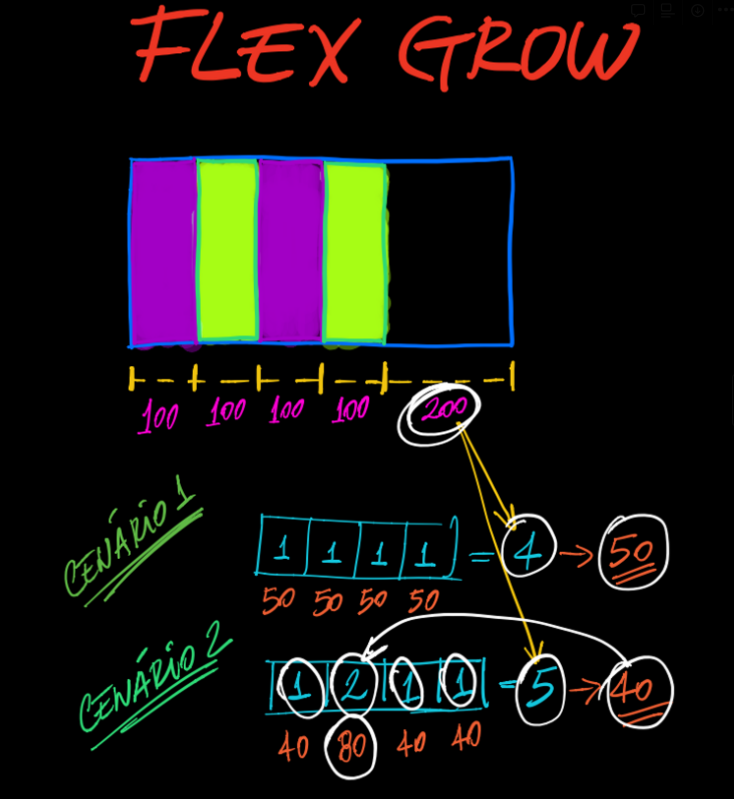

Na imagem acima no cenario 1  ele ira dividir o espaço dos 200 pelos 4 colunas ficando 50px a mais para cada coluna. Então se a coluna que tem 100 passara a ter 150px

Na imagem do cenario2 você consegue escolher qual coluna tera um tamanho maior que os outros.

# Grid

O Módulo de layout de grade CSS oferece um sistema de layout baseado em grade, com linhas e colunas, facilitando o design de páginas da Web sem a necessidade de usar flutuações e posicionamento.

O Flexbox é ideal para layouts unidimensionais, como elementos dispostos em uma linha ou coluna, enquanto o Grid é mais adequado para layouts bidimensionais, com elementos organizados em uma estrutura de grade.

Exemplo para esses botões que estão na mesma direção o ideal é usar flex box 

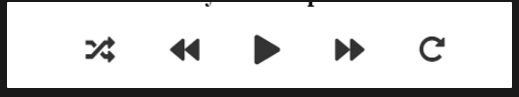

é possível dar nomes as linhas do grid:

```css
body {
	display: grid;
	grid-template-columns:
		[inicio] 1fr [metade-1 meio-1] 1fr [metade-2 meio-2] 1fr [fim];
	grid-template-rows: repeat(3,1fr);
}
```